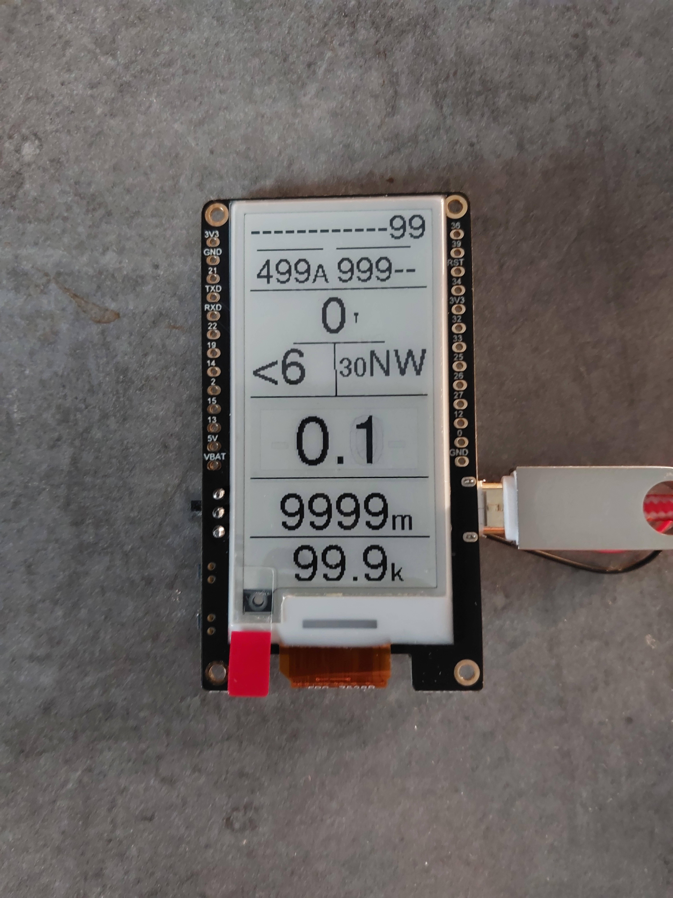
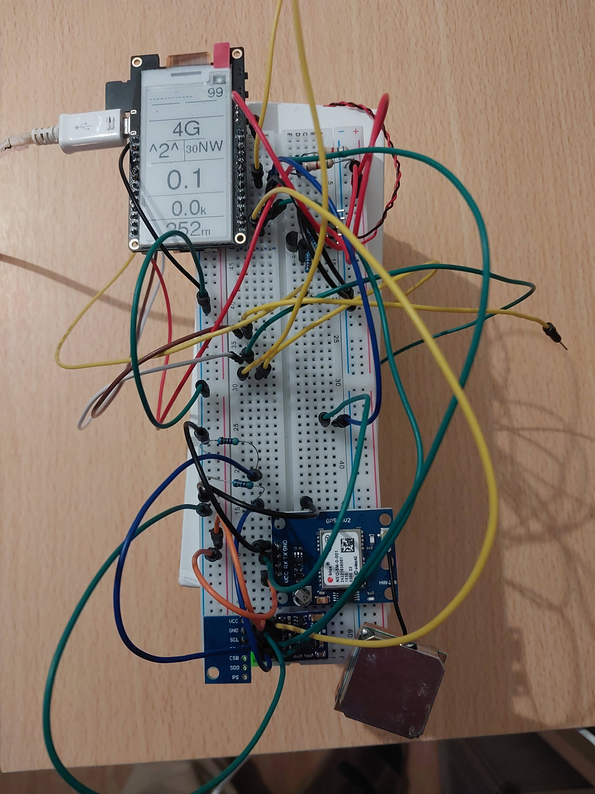
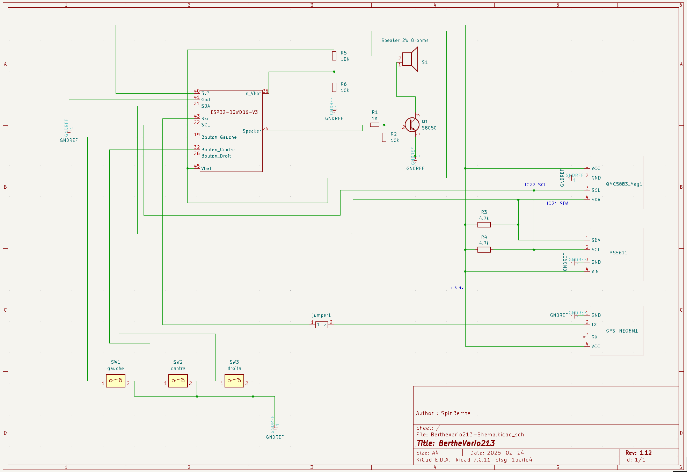

# Projet BertheVario213

Projet d'alti vario gps parapente (avec gestion des TMA CTR..., et mode guidage sol pour randonnée).
- Compatible bluetooth / XCTrack si nécessaire.
- Code C++ Visual Studio/PlateformIO.
- Plateforme Espressif ESP32 Dev Module, LILYGO T5 v2.3.1 GDEM0213T5BN 9102 chip, écran 2.13inch DEPG0213BN, Arduino (processeur 32bits, dual core, 240Mhz).

**La carte de base :**

 

**Le schema electrique :**

**Le pcb :**

- en construction

mail: spinberthe@gmail.com
